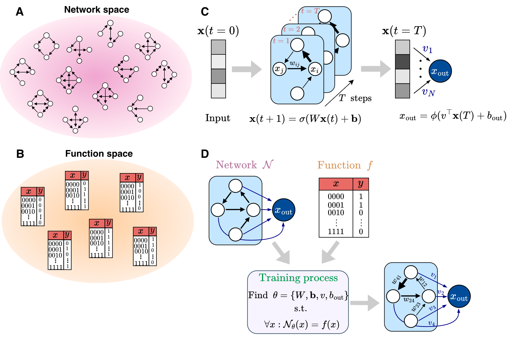

# Identifying structural design principles shaping the computational abilities of recurrent neural networks

Code for *Identifying structural design principles shaping the computational abilities of recurrent neural networks* by Tom Talpir and Elad Schneidman

Preprint: [arxiv.org/abs/2606.23874](https://arxiv.org/abs/2606.23874)

## Abstract

Understanding how the architecture of neural networks shapes the computations they carry is a central
challenge in neuroscience and machine learning. While specific circuit architectures have been linked to
particular network computations and theoretical bounds on expressivity of broad classes of networks have
been found, we are still missing general principles connecting the structure of finite networks to their
computational capabilities. Here, we characterize the computational abilities of recurrent neural networks
as a function of their connectivity by training a large collection of different networks to compute a large
set of Boolean functions. For small networks, we constructed the complete "catalogs" of network-function
performance, which revealed that computational capacity varies widely across architectures and that most
networks show poor performance, and most functions are hard to compute. However, we show that having local
2- and 3-cycles in a network strongly enhances its computational ability, and networks with such cycles are
often the minimal architectures that can solve particular functions. We further show that a small set of
structural statistics accurately predict networks' performance. Extending our analysis to large networks
showed that typical networks fail even to approximate a randomly selected function. Surprisingly, adding a
small number of sparsely connected biologically-inspired interneurons to the network dramatically increases
computational capacity. As in small networks, adding short cycles improved networks' capacity,
outperforming acyclic or reachability-matched controls. Thus, our results identify local cycles as design
principles linking neural connectivity to computational power, and offer a general framework to explore
structure-function relations in computing networks.



*We train every network topology on every Boolean function to build complete network-function catalogs,
then ask which structural features of a network predict what it can compute.*

## Repository layout

```
core/
  truth_table.py              TruthTable (Boolean-function storage, indexing, similarity) and
                              TruthTableDataset (the PyTorch-facing wrapper)
  network.py                  Network — numpy base class holding a topology and its weights
  pytorch_network.py          The RNNs that actually get trained: PytorchNet_ReadoutNeuron,
                              PytorchNet_Interneurons_And_Readout, PytorchNetwork, SparseMaskedRNN
utils/
  topology.py                 int <-> adjacency conversion, exhaustive topology enumeration,
                              cycle/motif counting, 3-reachability, network equivalence classes, and the
                              graph-generator models (ER, input-expanding DAG, random DAG,
                              reachability-without-3-cycles, enriched-3-cycles)
  truth_tables.py             Boolean-function enumeration and sampling, function equivalence classes,
                              Fourier expansion, max degree, total influence
  training.py                 run_training_loop and train_model — the BPTT + Adam + BCE training loops
  catalog_matrix.py           Catalog and approximation matrices, Utility and Accuracy, Hamming distance,
                              equivalence-class reduction, hierarchy graphs, Minimal Solvers
  prediction.py               Structure -> performance predictor: train/test splits over networks and
                              functions, predicting Utility/Accuracy from edge/cycle/motif counts
  nn_models.py                The small models and metrics the predictor uses (LinReg, FF_1Layer,
                              FF_2Layer, DeepFF, R^2)
large_network_sweeps.py       Large-network sweep drivers plus the exact paper configurations behind
                              Figures 5 and 6

demo/
  quickstart.py               Small end-to-end N=3 run exercising the real training pipeline
figures/
  paper_figures.ipynb         Generates all manuscript figures
tests/                        Unit tests for the pure-logic utilities plus integration tests for the
                              network and training code
requirements.txt
```

## Installation

Requires **Python 3.12**.

```bash
pip install -r requirements.txt
```

Key dependencies: `numpy`, `scipy`, `pandas`, `scikit-learn`, `networkx`, `torch`, `matplotlib`,
`seaborn`, `tqdm`, `jupyter`. Training runs on CPU or CUDA; the sweep drivers pick up a GPU
automatically when one is available.

## Quick start

```bash
python demo/quickstart.py
```

Runs a small end-to-end N=3 training loop — a handful of topologies against four Boolean functions
(constant-0, majority, parity, constant-1) — printing the final accuracy for each topology/function pair.
This is the same code path the full catalogs use, just at a size that finishes in under a minute.

## Reproducing the figures

All manuscript figures are produced by **`figures/paper_figures.ipynb`**, which has one section per
figure. Each section defines its input paths in its first code cell — point those at your own run output.

| Notebook section | Produces | Required data |
|---|---|---|
| Figure 2 | Catalog/approximation matrix heatmaps, Utility and Accuracy distributions, Hamming-distance network similarity | N=3 and N=4 catalog matrices. See `utils.topology.get_all_topologies` and `utils.truth_tables.get_all_truth_tables` for generating all networks and functions, and `demo/quickstart.py` for a training example. 
| Figure 3 | Equivalence-class hierarchy trees, Minimal Solver counts | The same catalog matrices, plus precomputed network and function equivalence classes |
| Figure 4 | Structural features vs. Utility/Accuracy, and the structure -> performance predictor | The same catalog matrices. The predictor section can either retrain inline or load a precomputed results CSV |
| Figures 5 and 6 | Graph-model comparisons across network size and density, 3-cycle counts | Networks and functions sampled from different models. See `large_network_sweeps.py` for full spec. |
